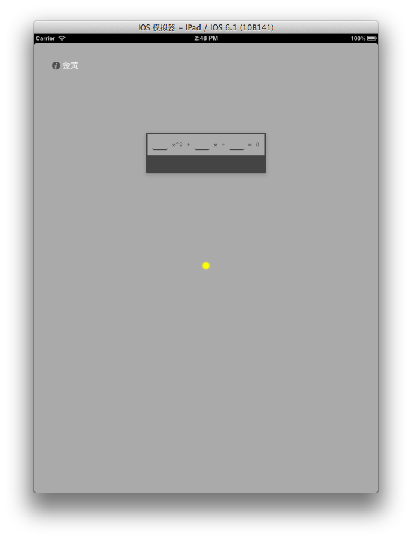
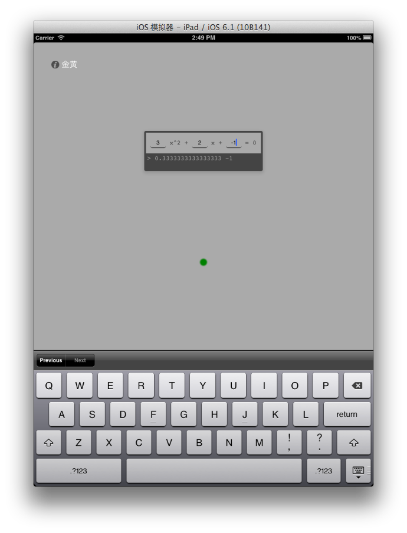
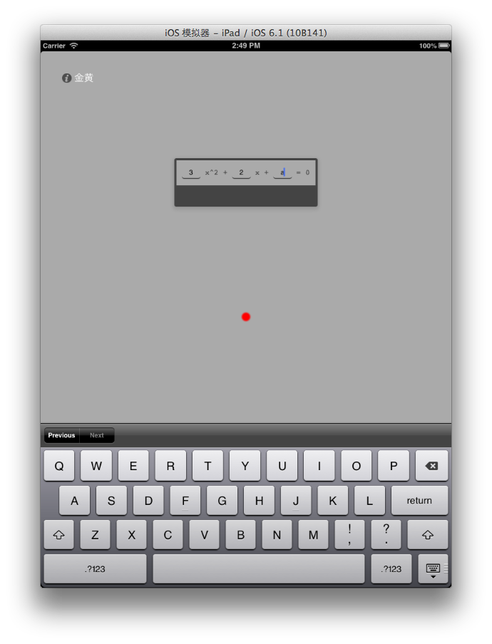

#说明

> Hybird 是一个构建了 Native App 与 UIWebView 中的 HTML 双向通信的 demo

##协议
规定 Javascript 通知 Native App 时以字符串遵从如下格式传入:
	
	"nativeEvent:" + eventName +",withArgument:" + argument

##原理
###Native -> WebView

iOS UIWebView 自带`stringByEvaluatingJavaScriptFromString`方法提供在 UIWebView 中执行 JS 的方法，于是构造如下函数

	- (void)runwithJavascript:(NSString*) jsCode
	{
	    [self.contentwebView stringByEvaluatingJavaScriptFromString:jsCode];
	}
	
###WebView -> Native
Javascript 并不能直接通知 Native，只有当网页去叫新的请求时，UIWebView 的 `shouldStartLoadWithRequest` 会被调用。

于是在 Javascript 中构造模拟请求的函数，并按照上面规定的协议实现传值

	function RaiseNativeEvent (eventName,argument) {
		var iframe = document.createElement("IFRAME");
		iframe.setAttribute("src", "nativeEvent:" + eventName +",withArgument:" + argument);
		document.documentElement.appendChild(iframe);
		iframe.parentNode.removeChild(iframe);
		iframe = null;
	}

然后在本地代码识别传值事件
	
	- (BOOL)webView:(UIWebView *)webView shouldStartLoadWithRequest:(NSURLRequest *)request navigationType:(UIWebViewNavigationType)navigationType
	{
	    NSString* url = [[request URL] absoluteString];
	    
	    if([url hasPrefix:@"nativeevent"]){
			//确定为RaiseNativeEvent 出发的请求，下面解析参数，处理
	    }
	    
	    return YES;
	}
	
	
# demo
hybird 中本地控件包含

* 一个 UIWebView 
* 一个按钮

网页端包含

* 一个一元二次计算器
* 一个默认隐藏的提示灯

当点击本地的按钮时，通知网页端点亮提示灯，并改为**黄色**  (Native -> WebView)

	- (void)buttonPressed
	{
	    [self updateIndicator:@"yellow"];
	}



当在计算器中输入数字时，JS 端会检测输入是否合法，并将结果传给 Native

	if(parameter.HasValue){
		//合法
		RaiseNativeEvent('valid',calculateByParameter(parameter.Value));
	}else{
		//不合法
		RaiseNativeEvent('invalid',"invalid parameters!");
		}
	}

Native 根据传入结果再去通知网页改变其中的提示灯颜色

* 合法改为**绿色**
* 不合法改为**红色**






```

-(void)updateIndicator:(NSString*) cssColor
{
    [self runwithJavascript:[NSString stringWithFormat:@"updateIndicatorStatue('%@')",cssColor]];
}


- (BOOL)webView:(UIWebView *)webView shouldStartLoadWithRequest:(NSURLRequest *)request navigationType:(UIWebViewNavigationType)navigationType
{
    NSString* url = [[request URL] absoluteString];
    NSLog(@"%@",url);
    
    //在 js 端 RaiseNativeEvent 中定义的特殊前缀，用识别来发来的消息
    if([url hasPrefix:@"nativeevent"]){
        if([url rangeOfString:@"invalid"].location != NSNotFound){
            [self updateIndicator:@"red"];
        }else{
            [self updateIndicator:@"green"];
        }
    }
    
    
    return YES;
}
```
